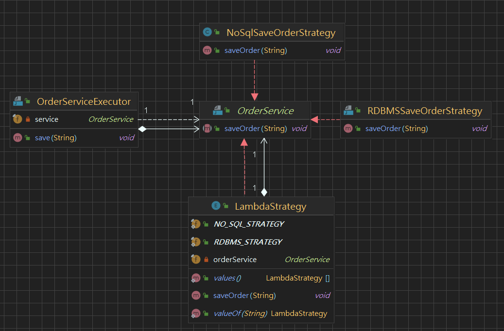
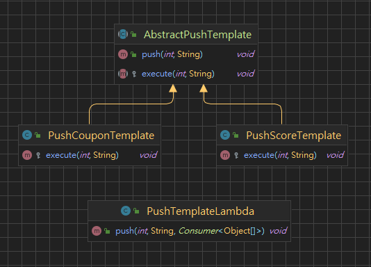
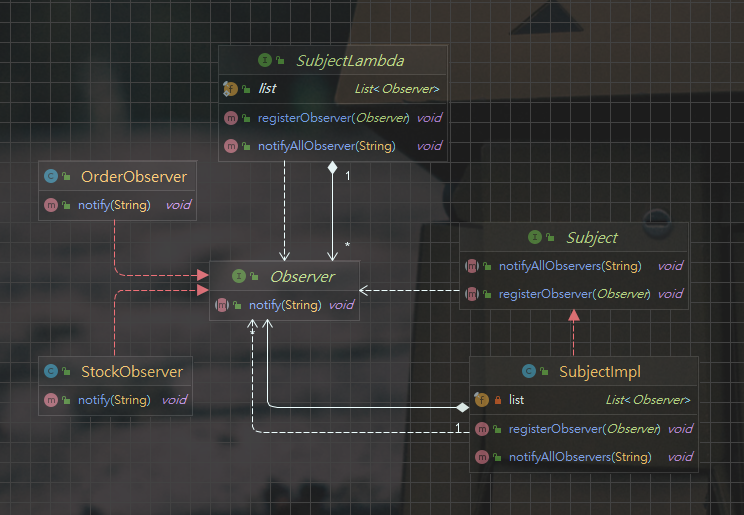
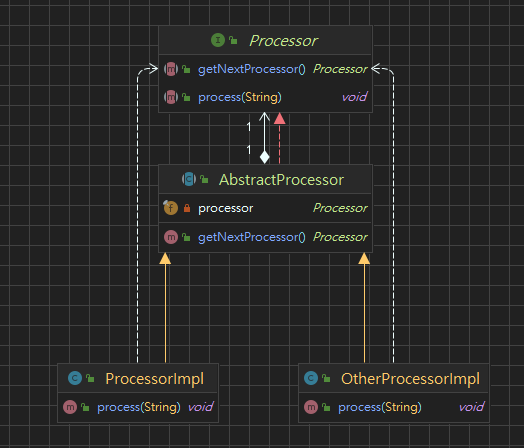
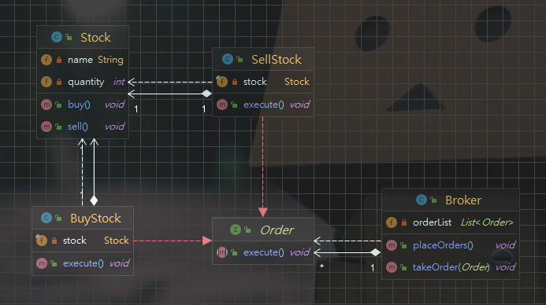

# Design-patterns

## 策略模式 Strategy-pattern - 行為型設計模式

* 一般使用方式
* Lambda 使用方式
* Enum 使用方式

策略模式的主要目的是允許在運行時選擇不同的算法或策略。  
策略模式是一種較為具體的模式，它通常涉及到實現不同的算法或策略。  
策略模式中，不同的算法或策略通常以不同的類別實現，並且在運行時可以動態地選擇算法或策略。

## 模板模式 Template-pattern - 行為型設計模式

* 一般使用方式
* Lambda 使用方式

模板模式的主要目的是定義算法的框架，以便子類別可以根據需要進行修改。  
模板模式是一種較為抽象的模式，它通常涉及到定義算法的框架和步驟。  
模板模式中，算法的框架和步驟通常在父類別中定義，並且可以在子類別中進行修改或實現。

## 觀察者模式 Observer-pattern - 行為型設計模式

* 一般使用方式
* Lambda 使用方式

物件之間建立一對多的依賴關係。  
當一個物件的狀態發生變化時，它的所有依賴者都會收到通知並作出相應的反應。  
觀察者模式適用於當需要實現一個消息發佈和訂閱系統時，或需要實現一個多層次的事件處理機制時。

## 責任練模式 Chain of Responsibility pattern - 行為型設計模式

將請求發送者與接收者解耦，使多個對象都有機會處理請求。  
在責任鏈模式中，請求沿著一條由多個接收者組成的鏈進行傳遞，直到有一個接收者處理該請求為止。

## 命令模式 Command pattern - 行為型設計模式

Broker 為調用對象類  
Stock 作為請求類  
Order 為命令介面  
BuyStock 和 SellStock 為實體命令類

將一個請求轉換為一個對象，這個對象包含有關請求的所有信息。  
這個對象然後可以被用於執行該請求，或者將其推入隊列中，或者還可以撤銷該請求。